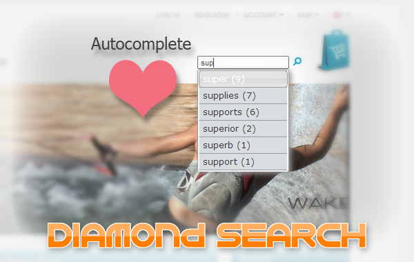
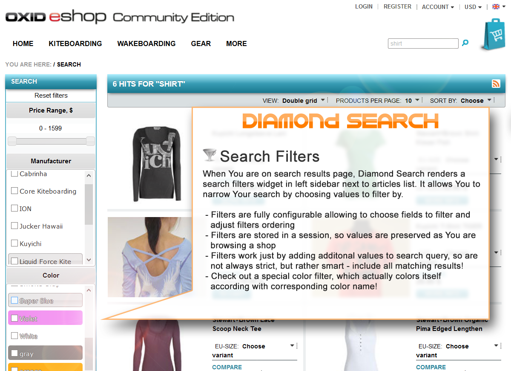
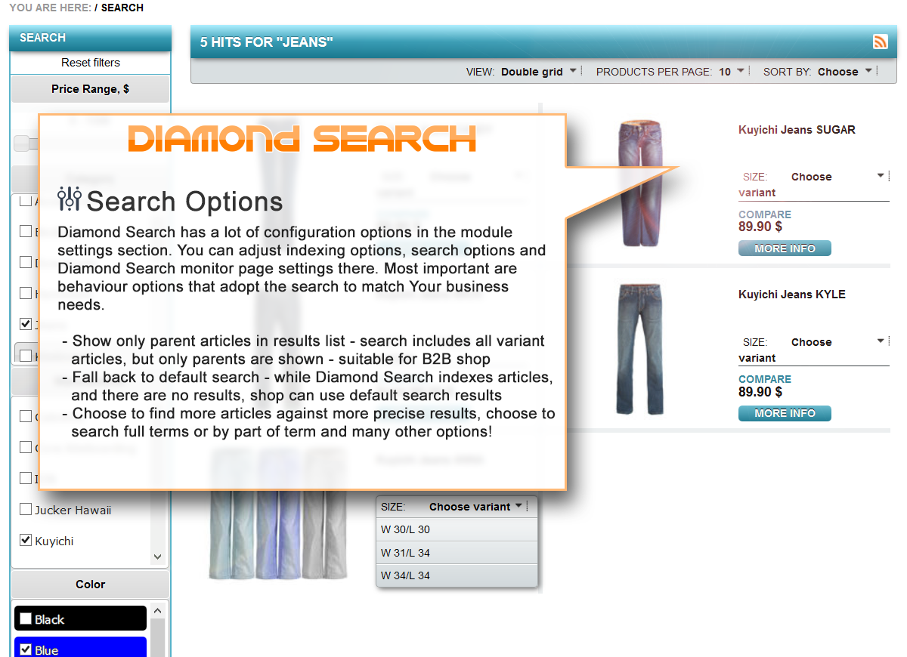
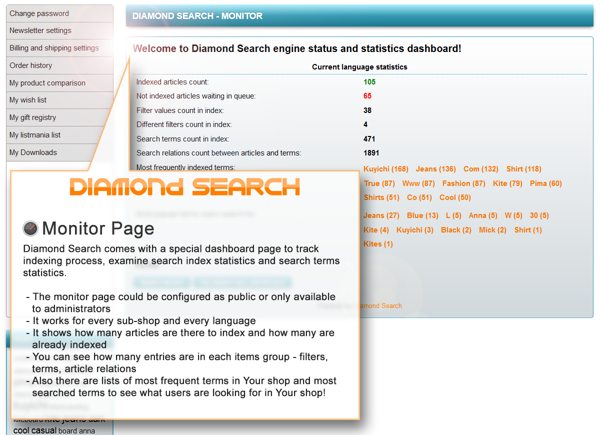

Diamond Search CE
=================

[Official Website](http://www.druteika.lt/#diamond_search_for_oxid_eshop) | [Diamond Search EE, PE Live Demo!](http://www.druteika.lt/diamond_search_demo/) | [Diamond Search EE, PE on eXchange Store](http://exchange.oxid-esales.com/Shopping-experience/Shop-search/Diamond-Search-EE-PE-0-3-0-Stable-EE-PE-4-7-x-5-0-x-4-8-x-5-1-x.html)

Diamond Search - Simply brilliant out-of-the-box search engine for OXID eShop!
------------------------------------------------------------------------------

 - Search by all relevant article fields, categories, manufacturers, vendors, variants selections and attributes
 - Search field auto-complete function
 - Configurable search filters
 - Unlimited Multi-shops and multilingual shops support
 - No server configuration, no integrations, no setup or indexing effort - just install the module and activate it!
 - Articles will index for first time and re-index on changes automatically
 - Excellent performance even with large amount of articles
 - Easily configurable search options in administration back-end
 - Customize fields to search by, set ranking options, add Your custom fields
 - Lots of useful search settings to match Your needs
 - Monitor page to track indexing process
 - Advanced search form
 - Promotion articles widget

What's new in v0.4.x
--------------------
 - Compatibility with OXID eShop v4.9.x/v5.2.x
 - Advanced search form widget
    - Fully configurable fields to filter by
    - Works as a combined filer compatible with sidebar filters
 - Promotion articles widget
    - Articles selection box widget
    - Configurable in back end for default selection
    - Also could be inserted as a widget with custom parameters
    - Selection is based on Diamond Search engine
 - Stop words list for unwanted search terms
    - Pre-configured for most common not needed search keywords
    - Configurable per language for custom keywords exclusion
 - Search filters adjusted
    - Selected filter is highlighted
    - If filter is selected, other values are not shown
 - Bug fixes and refactoring
    - German language specific words parsing fixed
    - Filter values URL encoding issues fixed
    - Search parser values decoding and split bug fixed
    - CMS pages rendering failure bug fixed
    - Variant indexing on parent article save implemented
    - Variants removal from index on parent article deletion/deactivation

What's new in v0.3.x
--------------------
 - Price range filter (EE, PE editions only)
 - New search option - find parent articles only (EE, PE editions only)
 - Extended monitor page (EE, PE editions only)
    - More statistics for index contents
    - Most frequent search terms
    - Most popular search terms
    - Configuration options for statistics count and access settings
 - Personalized search hints in auto-complete (EE, PE editions only)
    - Stores successful search queries
    - When searching again suggest saved terms on top of the auto-complete list
 - Performance Booster (EE, PE editions only)
    - Module is pre-configured for maximum performance
    - Optimized indexing and search processes
      - Database indexes design tested and improved
      - Queries refactored for best performance
      - Removed redundant functionality to make indexing faster
      - Other performance fixes in indexing process
 - Bug fixes and improvements
    - Search filters shown only in search page sidebar
    - Extended hits count display setting implementation
    - Added monitor page link in administration area main menu
    - Other minor fixes

What's new in v0.2.x
--------------------
 - Search filters
    - Fields configuration allows to set filter option
    - Search filters sidebar widget introduced
    - Color filter has special colored style for simple color names
    - Filter results are stored in session and processed on background
 - Configurable option - Index on change. Article is indexed immediately on save.
 - Article extends model support created, fields added to default configuration
 - Added configurable search statistics saving
 - Structure changes
    - Fields configuration file is now named config.php
    - All sample attributes area added to default fields configuration
    - Module is now independent of DB views - unlimited multi-shops and languages are supported
    - Database tables indexes were optimized for best performance
    - Cron script now has more documentation inside comments
 - Bug fixes:
    - Cron script messages format fixed
    - Faulty article indexing "trap" fixed
    - Save hooks for models are fixed to set required fields on firs save only
	- Sorting by price and title fixed
	- Older versions support added
    - Other minor fixes

How to install the module
-------------------------
 - Copy everything from copy_this/ package folder to Your OXID eShop root directory.
 - Activate the module in administration back-end.

That's it!
Optionally adjust module settings (in administration back-end) and configure cron (see cron.php script comments).
